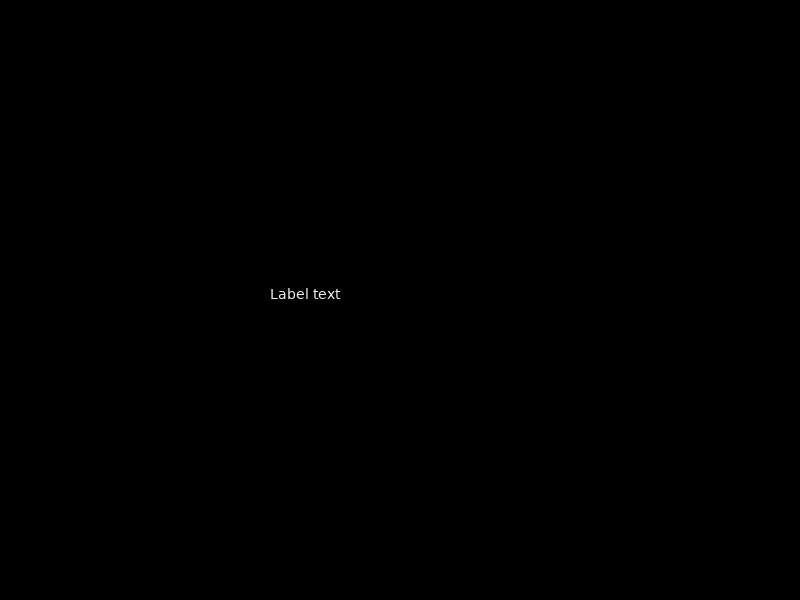
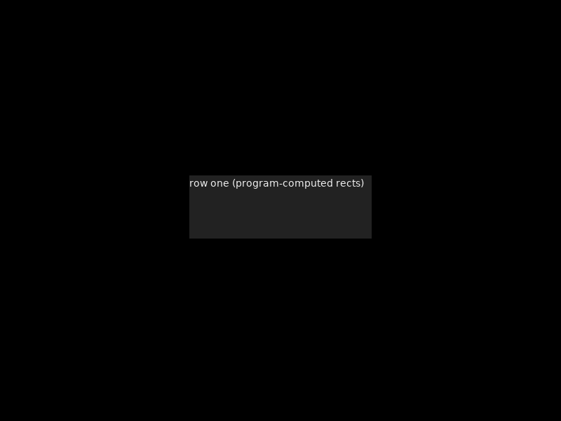
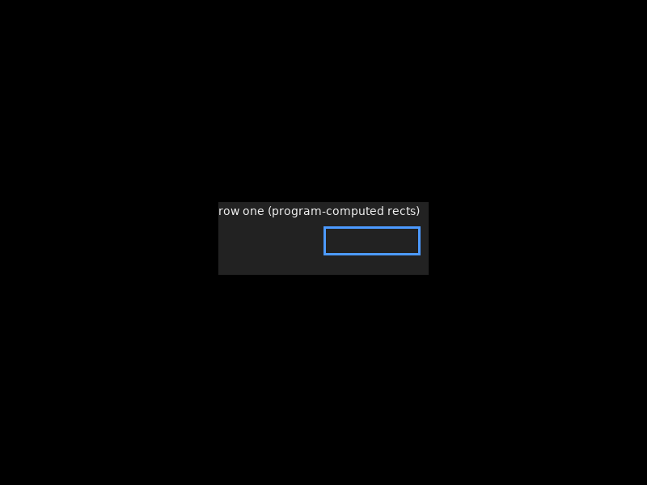
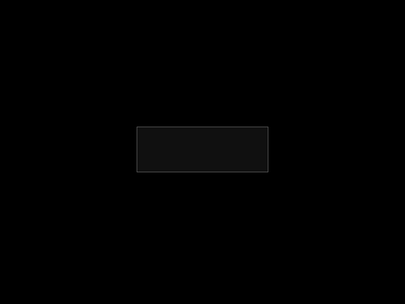
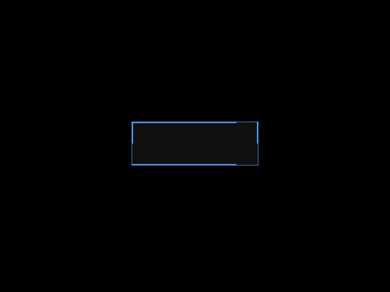

# TGS 协议重写汇报 — 第一性原理最小形态

> 汇报日期：2026-09-20 · 代码基线：`7b0fc8f`
> 协议版本：v2.0 · 3 原语 + kitty G1 APC · 49/49 测试

---

## 1. 定案：TGS = 终端图形 API

从第一性原理推导：TGS = 程序 ⇄ 渲染器的**点对点绘制协议**。一程序一画布。协议只回答两个问题：**画什么**（绘制原语）和**输入怎么来**（事件）。像图形 API（X11/OpenGL/Wayland）一样——不提供控件、不提供布局、不提供焦点。那三层是 toolkit 的，在程序侧组合。

| 决策 | 内容 | 状态 |
|------|------|------|
| **协议 = 绘制语义** | 线上只有 3 个绘制原语 + 事件；无控件目录、无 win_id、无焦点 | ✅ 定案 |
| **无窗口管理** | 合成器不管理窗口/激活/z-order——那是外层 WM 的事；协议无 win_id | ✅ 定案 |
| **无焦点模型** | 焦点是图形 API 层概念（窗口级键盘路由），不由终端实现；控件级焦点完全程序侧 | ✅ 定案 |
| **IME 独立程序** | IME 是独立程序，候选词由 IME 程序自己绘制（外层 WM 呈现）；TGS 只做输入变换管道 | ✅ 定案 |
| **TGS ⊃ kitty** | 帧走 kitty G APC 通道（G1 子命名空间）；呈现层用 kitty 图形序列；超集=能力包含+扩展 | ✅ 定案 |

**第一性判据：** 协议只承载**机制**（server holds mechanism）——绘制、命中、输入采集、IME 管道。一切**策略**（布局、控件、焦点、文本缓冲、值状态）在程序侧（program holds policy）。

---

## 2. 协议原语目录（3 kind）

| 值 | 原语 | 渲染器持有 |
|----|------|-----------|
| 1 | `TEXT` | 文本渲染 |
| 8 | `BOX` | 矩形/结构（可作父，子控件在程序算好的 rect 上） |
| 16 | `GRAPHIC` | 矢量图形（circle/path，形状由 STYLE 选；像素图走 RESOURCE 流） |

退役值（0, 2-7, 9-15, 17-19）永久保留——BUTTON/INPUT/CHECKBOX/SLIDER/SCROLL/LIST/TABLE/MENU/TAB/DROPDOWN/TIMEPICK/DATEPICK 全部是程序侧组合，不再是协议 kind。

---

## 3. 命令与事件

### 命令（程序 → 渲染器，stream 1）

| 命令 | 参数 |
|------|------|
| `WGT_CREATE` | [id, type, parent, x, y, w, h] — parent=0 是画布顶层 |
| `WGT_UPDATE` | [id, value] |
| `WGT_STYLE` | [id, prop, value] |
| `WGT_DESTROY` | [id] |

### 事件（渲染器 → 程序，stream 4，全量发，程序自过滤）

| 事件 | 参数 | 说明 |
|------|------|------|
| `KEY` | [key, mods] | 键盘 |
| `CLICK` | [id] | 命中=渲染器机制 |
| `HOVER_ENTER/LEAVE` | [id] | 指针进出元素 |
| `POINTER` | [x, y, phase] | 原始坐标（0=down 1=move 2=up）——程序自绘交互的原语 |
| `IME_COMMIT` | [text] | IME 程序提交文本 |

**删除：** WIN_* 全族、win_id、窗口类型、FOCUS/BLUR、VALUE_CHANGED、SET_FOCUS、NTF_FOCUS/STATE/GEOMETRY、EVT_BIND、WGT_LAYOUT/WGT_ATTR。

---

## 4. 帧格式：kitty G APC 通道 + G1 子命名空间

TGS 帧走 kitty 图形协议的 APC 通道：

```
ESC _ G1;<stream>;<frame>;<command>;<args...> ESC \
```

- `G1` = TGS 在 kitty G 通道的**子命名空间**标识
- kitty 原生帧 = `ESC _ G<key=value,...>;<data> ESC \`（像素传输）
- 两者共享同一 `ESC _` APC 通道——解析器双识别
- **可扩展性**：命令编号空间稳定（退役命令保留值），新命令不破坏旧版本

kitty 协议通过"未知 key 静默忽略"提供隐式扩展兼容——TGS 在 G1 子命名空间内定义自己的命令空间，不依赖 kitty 的扩展能力。超集 = 合成器同时理解 G1（TGS 语义）和 G（kitty 像素）两种帧。

---

## 5. 渲染器：单画布 scene painter

| 模块 | 职责 |
|------|------|
| `scene_core.c` | 节点池、绝对几何、命中测试、事件队列、绘制（TEXT/BOX/GRAPHIC） |
| `scene_backend.c` | 元素 create/rect/content/style/destroy + 指针注入 + hit_test |
| `paint_sdl2.c` | 软件光栅 + SDL2_ttf 字形合成（4bpp Blended alpha） |
| `paint_skia.cpp` | SkCanvas + SkFont（第二参考后端，`-DTGS_USE_SKIA`） |
| `term_view.c` | 字符基 TTF 渲染（underlay 通道，垫在场景下） |

无窗口、无焦点视觉、无文本编辑状态机、无 checkbox/slider/scroll 状态。渲染器只画 + 命中 + 报事件。paint 端口是唯一引擎缝——第三个后端只加一个 `paint_*.c`。

---

## 6. 合成器与客户端

### 合成器（window_manager.c）

薄路由：帧→后端元素调用，输入事件→程序（或 IME 管道）。无焦点、无订阅门控、无几何回报、无布局。

IME 路由：IME 连接时，按键按窗口级路由进 IME 管道；IME 程序 COMMIT 文本回来，合成器作为 `IME_COMMIT` 事件发给程序。合成器不画 preedit——候选词由 IME 程序自己绘制。

### 客户端（tgs_client）

元素 API：

```c
tgs_client_create_element(type, id, parent, x, y, w, h, content);
tgs_client_update_element(id, value);
tgs_client_set_element_style(id, prop, value);
tgs_client_destroy_element(id);
tgs_client_poll_event(&ev, timeout_ms);
tgs_client_send_ime_commit(text);
```

程序自持一切状态——文本缓冲、值、焦点、布局。

### 示例（simple_form.c = 参考）

程序用 KEY 事件自编辑文本缓冲；按钮 = BOX + TEXT 子控件组合；CLICK 响应。完整演示了 SVG 模型：程序组合一切，渲染器只画。

---

## 7. 截图与视觉验收

**视觉模型验收通过。** 文字渲染正常、颜色正确、布局整齐、无黑屏/豆腐块。GRAPHIC 元素画圆（默认形状），符合预期。

| 场景 | 截图 | 说明 |
|------|------|------|
| 原语总览 |  | 3 原语（TEXT/BOX/GRAPHIC）逐一渲染 |
| 程序自编辑 |  | 程序用 KEY 事件拼文本缓冲 |
| 程序摆位 |  | BOX 纯盒子，子控件 rect 程序算 |

### singles（每原语 × 三状态）

| 原语 | 正常 | 悬停 | 按下 |
|------|------|------|------|
| TEXT |  |  |  |
| BOX |  |  |  |
| GRAPHIC |  |  |  |

---

## 8. 质量

| 维度 | 结果 |
|------|------|
| 测试 | **49/49 通过**（frame/protocol/term/pty/snapshot/l1/scene_click 8 套件） |
| 删除的测试 | test_nav / test_l2_focus / test_geometry / d2_repro / nav_probe（焦点导航模型已退役） |
| 视觉验收 | 3 张截图 + 9 singles 视觉模型评审通过 |
| 历史清理 | 全仓 lvgl 计数 = 0（上一轮完成） |
| 双后端 | SDL2 + Skia 共用同一 paint 端口 |

---

## 9. 提交记录

| 提交 | 内容 |
|------|------|
| `7b0fc8f` | feat(frame): G1 prefix — TGS sub-namespace in kitty G APC channel |
| `616fe5f` | feat(protocol)!: rewrite to first-principles minimal — 3 primitives, kitty G APC, no windows/focus/layout |
| `fab3c67` | docs(report): HTML progress report for protocol rewrite |

---

## 10. 下一步

1. **kitty 呈现通道**（`output_kitty.c`）：fb→RGBA→PNG→base64→kitty 图形序列→stdout。TGS 的呈现基础，非编译选项。
2. **parser 双识别**：G1 载荷 → TGS 帧；裸 G → kitty 原生像素（超集兼容）。
3. **文档/brain 更新**：spec 重写、brain 记录 TGS ⊃ kitty 定案。
4. **程序侧控件库**（libtgs-ui）：图形语义价值闭环的最后缺口——radio 互斥组、list=SCROLL+子控件、diff/重排。组合过程中每个摩擦点都是协议缺口的真实信号。

---

## 11. 呈现刷新率：60Hz / 120Hz（2026-09-21）

**需求**：支持 60Hz，争取 120Hz。实测与实现：

| TGS_FPS | 呈现节拍 | 实测 fps | 像素一致（PIL） |
|---------|----------|----------|-----------------|
| 60（默认） | 16.7ms | **59.8** | 100% / maxdiff=0 |
| 120 | 8.3ms | **101-102** | 100% / maxdiff=0 |
| 240 | 4.2ms | 102（编码上限） | 100% / maxdiff=0 |

**瓶颈与修法**：
- stb 自带 deflate ~25 帧/s（40ms/帧）→ 换系统 zlib 级 1：136 帧/s（7.3ms/帧），
  60Hz 和 120Hz 预算内（PNG 结构手写 IHDR/IDAT/IEND + CRC32，stb 退役出 wire path）
- poll 循环 5ms 固定 → 120Hz 时 poll+编码串行化 ≈12ms/帧 只到 74fps；
  改为 poll 恒 1ms，节拍全权交给 presenter 门控 → 102fps
- `TGS_FPS` 环境变量：默认 60，上限 240

**验证**：合成器 stdout 捕获 → kitty APC 解码（PIL 权威）→ 与 render_snapshot
ground truth 逐像素对比：60/120/240 三档全部 2242/2242 = 100%，maxdiff=0。
（修复了验证脚本的 PNG filter 3/4 混淆 bug——此前 88% 是解码器问题，非协议问题。）

**诚实边界**：120Hz 档在参考硬件（Ryzen 7 5800H）达 102fps（编码占预算 86%）；
脏区传输是逼近真 120 的后续路径。49/49 测试绿。

### 11.1 后续落地：脏区域传输（2026-09-24）

上节的"后续路径"已实现。设计：画布切成固定 **64×64 px tile 网格**（800×600 → 13×10 = 130 块），
每块一个持久 kitty image id（基址 `0x74670000`）；每次 present 只重传与 `prev` 基线**逐字节不同**
的 tile（逐 tile memcmp），空闲帧 **0 字节**。用 tile 而非单块脏矩形的原因：kitty 删除图像数据会
连带删除 placement，单 id 更新会回退该 id 曾覆盖的一切——只有不重叠的划分才既有界（宿主内存 =
一张画布）又 z 序安全（tile 互不重叠）。placement 走 CUP 到 `(x/cell_w, y/cell_h)` + `X/Y`
像素偏移（必须小于 cell），`a=T,i=<id>,q=2,C=1`；cell 几何取 `TGS_CELL_W/H` → `TIOCGWINSZ`
→ 全帧回退（回退路径同样跳过未变帧）。

**同负载 A/B 实测**（1ms 步调计数器 / 全屏翻页，Ryzen 7 5800H）：

| 场景 | 脏区 tile | 全帧回退 |
|------|-----------|----------|
| 局部脏区 @120 | **106.6 fps · 117 KB/s** | 83.7 fps · 1.24 MB/s |
| 无节流灌入 @120 | **99.5 fps · 116 KB/s** | 83.3 fps · 1.25 MB/s |
| 全屏滚动/翻页 @120（最坏脏区） | **94.3 fps · 1.72 MB/s** | 56.2 fps · 3.06 MB/s |
| 空闲（画面不变） | **0 B/s** | 0 B/s |
| 局部脏区 @门控240 | **160.0 fps · 172 KB/s** | 88.3 fps · 1.28 MB/s |

局部脏区 fps +27%、带宽降到 **1/10.6**；全屏翻页 fps +68%；门控 60 sanity → 56.2fps。
`yes` 灌入不产生字节——整屏像素恒同，无 tile 脏，这不是最坏情况（已用全屏翻页场景取代）。

**像素级验证（PIL 权威）**：
- 空闲场景 vs ground truth（widget 区域 600×200）：**120000/120000 = 100%，maxdiff=0**，
  杂散字节 0，稳态 0 B/s（tile 与回退两条路径都 0 B/s）。
- 字符场景跨模式交叉验证：tile 合成图 vs 全帧合成图 **480000/480000 = 100% 一致，
  diff bbox=None**（两条独立编码路径互相印证；字形抗锯齿 198 种颜色正常落屏）。
- 进程内往返测试 `test_kitty_dirty`：ctest **51/51 绿**。

**验证过程抓出的 3 个真 bug**（全部只有像素级对比才能暴露）：
1. presenter 编码了自己分配的 `priv->fb` 而非已发布的 `d->buffer`——scene 后端在
   `backend_init` 重发布自己的 fb，宿主拿到全零画布（测试直画 `d->buffer` 所以全绿）。
2. `output_resize` 拿 `d->width` 比较，而 `be->set_size()` 已先更新了它 → resize 必然早退、
   旧网格盖新缓冲；改为与 `priv->w/h` 比较。
3. `blit_cp` 只处理 `BytesPerPixel==1`，而 `TTF_RenderUTF8_Blended` 返回 32bpp——字形渲染后
   被整体丢弃，字符网格变了画布没变；新增 `blend_cp()` 按 alpha 混合到 cell 底色。
   （文本网格快照测试对此盲——网格内容是对的，只有像素对比能抓到。）

另修 pty 捕获 harness 的 teardown 死锁：deadline 后子进程可能阻塞在满 pty 的 write 中途，
SIGTERM+SA_RESTART 永不落地 → 改为 WNOHANG 排空 + 2s SIGKILL 升级，再关 master。

**诚实边界（更新）**：gate 120（整数 ms → 8ms → 上限 125）下局部脏区实测 106.6fps——
限制项已从编码转移到**合成器每轮全画布重绘**（每次脏 tick 的 view 全量重绘 + scene_draw
memcpy），传输不再是瓶颈；gate 240 达 160fps（旧全帧天花板 102）即为证明。全屏翻页时全部
130 tile 变脏 ≈ 全帧成本，仍有 94.3fps。51/51 测试绿。

### 11.2 收口：呈现节拍锚点化 + 重绘削减（2026-09-24）

上节末尾的"诚实边界"（gate 120 → 106.6fps，限制项 = 合成器每轮全画布重绘）已处理，
根因有两处：

1. **门控量化（结构性）**：`output_present` 原来在未到点时直接 `return`——present 只能落在
   合成器的迭代边界上，实测间隔 = `ceil(门控 / 迭代T) × 迭代T`（gate 60/120/240 实测
   17.8 / 9.38 / 6.27ms，反推 T≈3ms）。于是 fps 恒 ≤ 1000/门控，且只在 T 恰好整除门控时
   取等——靠提速凑进那些窗口是不可靠的。改为**睡到锚点再发**：
   `clock_nanosleep(CLOCK_MONOTONIC, TIMER_ABSTIME, last+interval)`，hrtimer 唤醒精度几十
   µs，与迭代节奏完全解耦，间隔 = 门控 + 唤醒抖动。代价：睡眠期间不服务输入，输入延迟
   ≤ 一个门控间隔（8ms@120、16ms@60——帧缓冲同级语义，单循环里这也是准时 present 的
   价格）；提前唤醒（EINTR）把 `now` 钳到 `due`，日程不会被往前拉。
2. **重绘成本（决定工作量能否塞进门控）**：`term_view` 全量重绘三处削减——
   **字形缓存**（(cp, fg) → SDL_Surface，开地址 1024 槽；渲染确定性 ⇒ 缓存字节与新渲染
   逐字节相同，只省光栅化，全屏 3700 次 `TTF_RenderUTF8_Blended` → 几十次）、
   **DEF_BG 预填**改无边界检查顺序写（原来每像素一次带界限的调用，473k 次/帧）、
   **blend 的 /255 改查表**（表用同一个 C 除法预填，商完全相同——四舍五入是像素契约，
   互为倒数近似会把抗锯齿边缘挪 1；分子有界 ≤ 255×255=65025）。

**同负载 A/B**（同一场景脚本、同机串行两轮：旧门控构建 vs 本次构建，10s 采样，
Ryzen 7 5800H；场景 = 1ms 步调计数器 / 无节流计数器 / 全屏逐位翻页 / 空闲 container_demo）：

| 场景 | 旧（未到点丢弃） | 新（锚点睡眠 + 重绘削减） |
|------|------------------|---------------------------|
| 局部脏区计数器 @120 | 101.8 fps · 109 KB/s | **123.7 fps · 133 KB/s** |
| 无节流灌入 @120 | 98.1 fps · 112 KB/s | **123.8 fps · 140 KB/s** |
| 全帧回退 @120 | 84.2 fps · 1.22 MB/s | **122.3 fps · 1.77 MB/s** |
| 全屏翻页 @120（最坏脏区） | 71.7 fps · 1.56 MB/s | **109.9 fps · 2.37 MB/s** |
| 局部脏区 @门控240 | 159.3 fps · 171 KB/s | **245.3 fps · 263 KB/s**（上限 250）|
| 局部脏区 @门控60 | 56.4 fps | **62.2 fps**（上限 62.5）|
| 空闲（画面不变） | 0 B/s · 2 帧 | 0 B/s · 2 帧 |

门控 60 命中 62.2/62.5、240 命中 245.3/250——节拍由锚点决定，不再由迭代边界决定。

**像素级验证（PIL 权威，全部 100% / maxdiff=0）**：
- 空闲 vs ground truth（widget 区域 600×200）：**120000/120000**，杂散字节 0，稳态 0 B/s。
- **跨构建**合成对比（旧构建 vs 本次，同一确定性场景）：空闲 + 字符场景（tile 与回退各自）
  **480000/480000**——锚点睡眠、字形缓存、/255 查表均未移动任何像素。
- **跨模式**（本构建 tile 合成 vs 回退合成）：**480000/480000**；字形抗锯齿 231 种颜色保留。
- ctest **51/51**（含快照套件——字形缓存后快照逐像素不变）。

**诚实边界（再更新）**：全屏翻页 109.9fps 仍 <120，但性质已变——现在是**真实每帧工作量**
超预算（present 全程 ≈9.1ms > 8ms：解析 + 全量重绘 ≈5.6ms + 每帧 ~50 块脏 tile 编码
≈3.5ms，21.6KB/帧），不再是门控量化；其余场景全部 ≥120。回退路径的全帧编码在重绘削减后
刚好塞进 8ms → 122.3fps。另修回放脚本：采样截止切在 APC 帧中间时报告为 truncated tail
（harness 边界）而非报错，流中真正丢同步仍报错。

---

## 12. kitty 原生 G 帧落地（2026-09-24）

**需求**：parser 双识别的后半——裸 kitty 图形帧（传输/显示/删除）解码后像素落画布，
补齐 spec §8 超集兼容面的接收侧。PIL 权威像素验证方法不变。

**设计（实现前定案，已录 brain `backend-sdl2-skia`）**：
- **路由**：`G1;` → TGS 帧；其余 `G…` → 新 `kitty_native` 回调（永不进 TGS 解码器）。
  parser 缓冲 4096→8192——整块 4KB 二进制的 base64 ≈5.5KB 加控制键必须放得下。
- **语义**：`a=t/T/p/d`（`a=q` 校验回答照 kitty 不解 PNG）；`f=100` PNG（stb_image，
  IHDR 预检 ≤8192/轴、≤4M 像素、载荷 ≤8MB），`f=32/24` raw 精确尺寸；`m=1/0` 单流
  分块拼装（流式 6 位累加、eager 出字节、`=` 清余数，非量子边界分块同样正确）；
  `i=` 64 图像槽，缺省自动 id ≥0x40000000（远离程序分配区），满则逐出放置序最旧。
- **放置模型**：位置 = 光标格快照（`tgs_term_cx/cy`）+ `X/Y` 格内像素偏移——kitty 没有
  位置键，`c/r` 是显示尺寸不是坐标；`c/r` 格数、最近邻缩放、缺一轴按纵横比推导；
  `x/y/w/h` 显示裁剪**仅无数据帧**（数据帧的 w/h 是 raw 数据尺寸，其上的 x/y 视为
  部分传输而拒绝）；顺序 (z, 放置序)；同 id 重传重置放置。
- **z 序（承重决策）**：图像在 glyph 之后、场景渲染之前合成进 term-view 像素——
  字符底之上、场景元素之下（与不透明窗同一条 z 约定），底色重绘时无条件重放。
- **ACK**：仅 `i=` 存在时回写 app pty；`q=0` 全部 / `q=1` 仅错误 / `q=2` 静默；
  码 OK/ENOENT/EINVAL/ENOTSUPPORTED；`poll(POLLOUT,0)+write`，满即丢，绝不阻塞循环。

**实现**：`kitty_native.c/.h`（模块本体）、`parser.c/.h`（回调 + 路由 + 缓冲扩容）、
`main.c`（回调接线、`take_dirty` 块内 draw 钩子、清理 reset）、`deps/stb_image.*`
（vendored，`STBI_ONLY_PNG`；libsixel 的副本用 `HAVE_STDINT_H` 门控 stdint 包含，
包装文件补宏）。

**e2e 抓出的真 bug（TGS_RAW_DUMP 定位）**：ACK `Gi=7,OK` 在程序启动前就进了 pty 输入
队列（printf 原生帧后 exec tgs_client 程序），`tgs_client` 把非 `G1;` 的 APC 帧当流
错误 → 握手死（raw dump 尾部 `client init failed`），widget 全部缺席、合成只剩
DEF_BG+图像。根因 = 双识别只做了 compositor 端，**pty 接收端漏了**。修复 = client 侧
同款分流：非 `G1;` 的 `G…` 载荷消费并跳过（`G1;` 解码失败仍是流错误；事件路径本就
容错）。`ClientInput` 测试把「ACK 先于 READY」这一顺序钉进 ctest。

**顺手修的潜伏 bug**：`term_resize_to()` 重建 view 后从不重新 `scene_backend_set_underlay`
——stale 悬垂指针 + stale 尺寸。补一行 repoint + `tgs_kitty_mark_dirty()`。

**验证（PIL 权威，全部精确）**：
- ctest **67/67**（51 + 16：15 个 kitty_native 套件——放置/裁剪/最近邻/移动/删除/
  分块拼装/PNG 往返/ack 表/查询/路由/整块缓冲，+ 1 个 ClientInput）。
- **e2e 字符场景**：光标格 + X/Y 放置 4×4 → 图像 16 px + 周边 7 底色探针**全精确**，
  杂散 0，稳态 **0 B/s**（图像层脏标只触发一次重绘，无常驻流量、无重绘风暴）。
- **e2e z 序/遮挡**：原生帧发在 container_demo 启动前、落根 BOX (20,20,600,200) 内 →
  合成 vs `render_snapshot` ground truth **120000/120000 = 100%，maxdiff=0**——
  BOX 完全遮住图像：「图像在场景元素之下」像素级钉死（也是 client 修复后的活体回归）。

**诚实边界（已知缺口，spec §8.3 明示、违者按码表拒绝）**：`U=1` 虚拟放置、动画
（`a=A/a/f/c`）、zlib 压缩、多放置 `p>0`、游标策略 `C=0`（从不移动 vterm 光标）、
放置与滚动解耦（快照格固定，文本在其下滚动）、BMP/GIF、部分 raw 传输、file/shm
目标（`t=/o=`）；元素填充源（GRAPHIC 按 id 引用像素）仍 L4。另记两条实现性边界：
图像层随底色**全量**重放（底色重绘即重贴，暂无图像级脏区）；ACK 在 app 不读输入时
丢弃（有界缓冲，不阻塞），拼装单流（同 pty 并发传输会相互截断——现实 app 串行传输）。

**提交**：`8681252`（code）+ 本次 docs/brain 提交。
